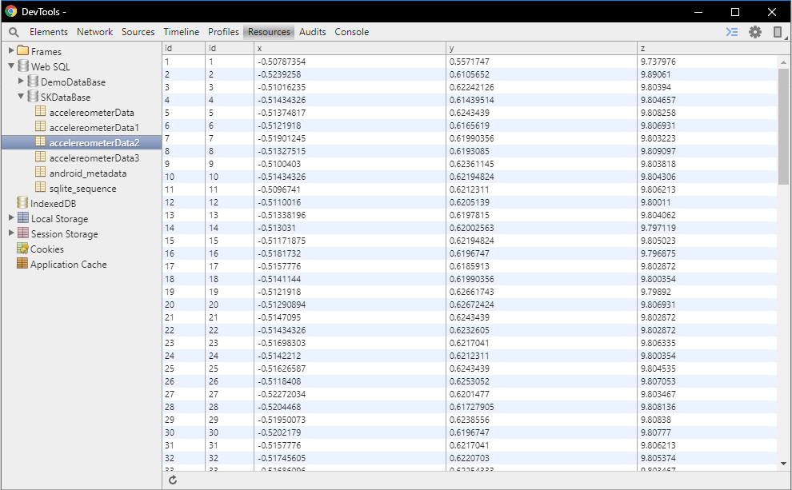

# PotholesDetection
<h3> Download app http://bit.ly/PotholeDetection </h3>
 
 

<h3>Road surface monitroing and finding major potholes is the task for this application</h3> 
<h3>Using smartphone's accelerometer sensor data potholes are detected and mapped on map</h3> 
<h3>App is under development </h3>  
<h3>Expected completion Feb 2020. </h3> 
 
